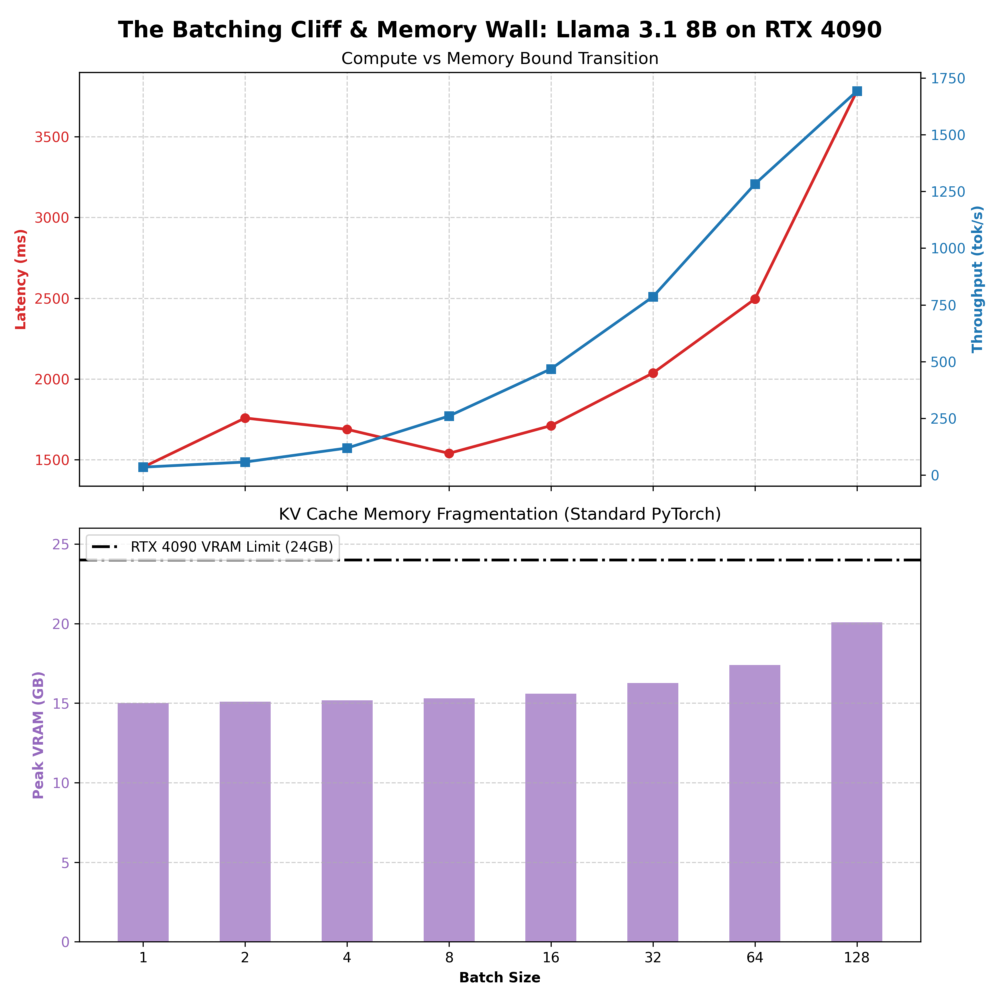

# Experiment 01: The Batching Cliff & Memory Wall

**Objective:** Profile the compute-bound vs. memory-bound transition of Llama 3.1 8B, measuring the exact impact of the KV Cache on High Bandwidth Memory (HBM).

## Hardware & Environment
* **GPU:** 1x NVIDIA RTX 4090 (24GB VRAM)
* **Model:** `meta-llama/Llama-3.1-8B-Instruct` (bfloat16)
* **Framework:** PyTorch 2.4.0 + CUDA 12.4

## Methodology
To identify the physical limits of the GPU, we benchmarked standard PyTorch auto-regressive generation across exponentially scaling batch sizes (1 to 128). We injected CUDA memory probes (`torch.cuda.max_memory_reserved()`) at the hardware level to track the memory allocation per sequence, isolating the static model weights from the dynamic KV Cache footprint.

## Results & Hardware Analysis

As demonstrated in the profiling data, standard PyTorch inference scales efficiently at lower batch sizes, but throughput severely saturates as we approach Batch 64 and beyond. This highlights three core systems-level constraints:

1. **The HBM Bottleneck (The Ceiling):** Throughput saturates because we hit the High Bandwidth Memory limit. The GPU physically cannot stream the 15GB of model weights plus the massive, dynamic KV Cache to the Tensor Cores fast enough to keep the math units fully utilized.
2. **Latency Explosion:** Because the compute cores are starved waiting for memory transfers, generation latency degrades almost linearly beyond Batch 64 due to massive hardware queuing.
3. **KV Cache Fragmentation (The Root Cause):** Peak VRAM profiling reveals that scaling from Batch 1 to 128 consumes an additional ~5.07 GB of VRAM. Because standard PyTorch aggressively pre-allocates massive, contiguous memory blocks for each sequence's KV Cache regardless of actual sequence length it creates severe memory fragmentation and wastes critical VRAM capacity.